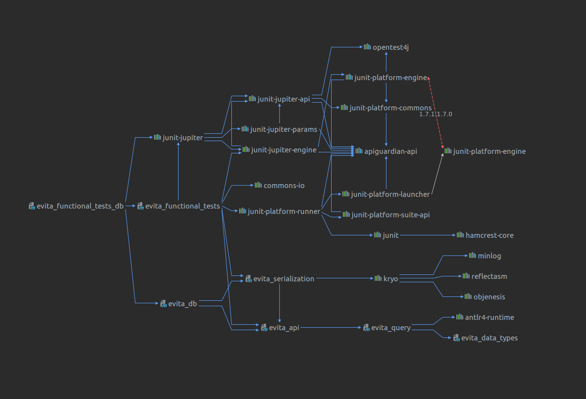
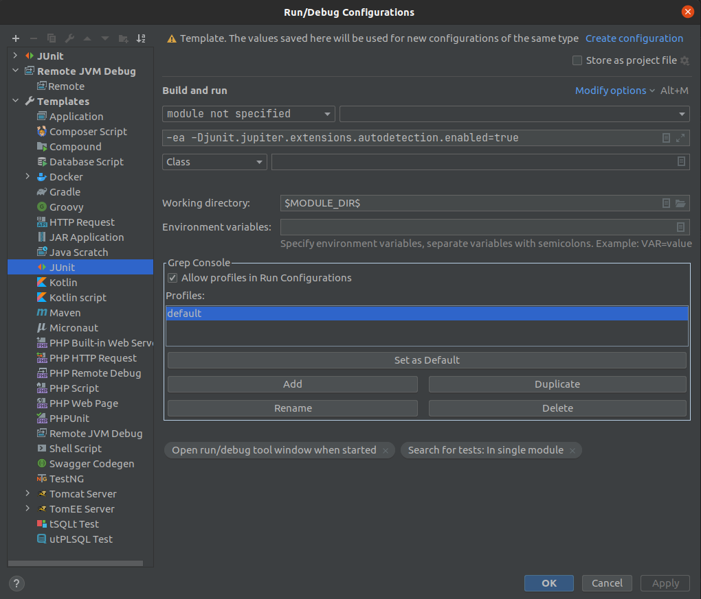
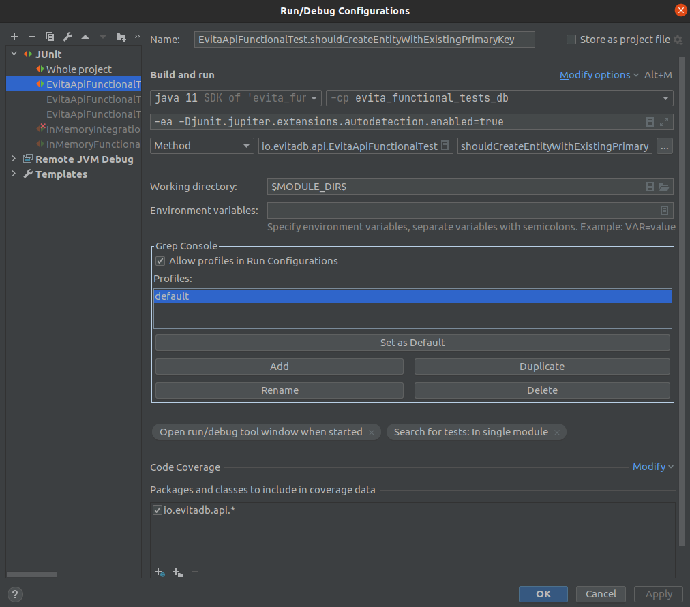

# Automatic testing

This repository requires Java 11.

## Unit testing

Unit tests are placed directly in the same JAR as production code that is being tested. Test classes should keep the
name of the tested class adding `Test` suffix. This pattern is automatically recognized by IDEs. Unit tests has no
tags or annotations. Unit tests are expected to be fast.

### Recommended usage

You can run tests in Maven by using:

```
mvn clean test -P evita
mvn clean test -P evita-sql
mvn clean test -P evita-es
```

## Functional and integration testing

Bodies of the **functional tests** are placed in `evita_functional_tests` module and are shared among all Evita DB implementations.
Functional tests operate against shared API / interfaces and are implementation agnostic. Functional tests use artificial
data that are constructed and created specially for each test to verify certain behaviour. The test data are relatively
small. Functional test suite is located in class `io.evitadb.FunctionalTestSuite`.

**Integration testing** use snapshot of production data. The data snapshots are placed in [Google Drive](https://drive.google.com/file/d/1M4w4ZW2CI2T_IJ7LpNsr4n7xgJkFoV73/view?usp=share_link)
and must be manually downloaded and placed in `data` folder with the name of the catalog. Data folder is excluded from 
Git and these data must never be added to Git. Integration test suite is located in class `io.evitadb.IntegrationTestSuite`.

Implementation specific code is present in these modules:

- **evita_functional_tests_db**: in memory implementation
- **evita_functional_tests_sql**: PostgreSQL database implementation (you need first to run [Docker image with PostgreSQL](evita_db_sql/src/test/resources/database/README.md))
- **evita_functional_tests_elastic**: Elasticsearch implementation  (you need first to run [Docker image with Elasticsearch](evita_db_elastic/src/main/resources/database/docker-compose.yml))

There is always only one of above-mentioned modules on classpath. The relation logic is as follows:



Implementation logic only provides access to the Evita DB instance but defines no other tests. There is also specific
class in each of those modules that extend from classes:

- `io.evitadb.FunctionalTestSuite`
- `io.evitadb.IntegrationTestSuite`

These classes allow running implementation specific full test suite from Maven (CI server) as well as manually in IDE.

### Recommended usage

You can run tests in Maven by using:

```
mvn clean test -P evita,functional
mvn clean test -P evita-sql,functional
mvn clean test -P evita-es,functional

or

mvn clean test -P evita,integration
mvn clean test -P evita-sql,integration
mvn clean test -P evita-es,integration
```

Or you can run tests in IntelliJ Idea, but you need to add Java argument `-Djunit.jupiter.extensions.autodetection.enabled=true`
to the runner configuration - see template for the runner:



#### Executing single functional test in IntelliJ Idea

You can also run single test in IntelliJ Idea - there is one catch. You need to configure the test to use classpath of
module with specific implementation - i.e. `evita_functional_tests_db` or `evita_functional_tests_sql` or 
`evita_functional_tests_elastic`. See picture:



If you don't do this you'll see this error:

```
org.junit.jupiter.api.extension.ParameterResolutionException: No ParameterResolver registered for parameter [EVITA evita] in method [...].
```

### Working with datasets shared for multiple tests

You can specify a non-test method that will prepare a shared dataset that will be used by multiple methods in the same class.
In test methods you may autowire Evita DB instance and specify a dataset that is required for this test. If previous
test used the same data set, it will be reused even for this test method. If there was different or no dataset, Evita
instance is cleared and initialized from scratch.

Example:

``` java
@CatalogName("testCatalog")
public class SomeTest {

	@DataSet("exampleDatSet")
	void setUp(EVITA evita, String catalogName) {
		evita.updateCatalog(catalogName, session -> {
			// initialize contents of the Evita with test data set
		});
	}

	@Test
	void shouldPerformTest(@UseDataSet("exampleDataSet") EVITA evita, String catalogName) {
		evita.queryCatalog(
			catalogName,
			session -> {
				// query the Evita DB data and expect contents of the example data set
			}
		);
	}
}
```

## Performance testing

Performance tests use [Java Microbenchmark Harness](https://openjdk.java.net/projects/code-tools/jmh/) as a vehicle for
execution of the test, collecting statistically correct results and producing report from the tests. For result visualization
we use [JMH Visualiser](http://jmh.morethan.io/) that uses report published publicly in GitHub Gist. Intro to write
JMH Microbenchmarks is located [at Baeldung](https://www.baeldung.com/java-microbenchmark-harness).

When you compile `evita_performance_tests` module, you get a `benchmarks.jar` in your `target` folder. To run all benchmarks
execute:

```
java -jar target/benchmarks.jar
```

You can use [a lot of options for JMH](https://github.com/guozheng/jmh-tutorial/blob/master/README.md). Particularly useful
are:

```
-e .*regularExpression.* -i 1 -wi 1 -f 0 -rf json -rff result.json
```

that speed up benchmark for running on locale in the way that it limits number of warmup iterations and recording iterations
to one and also disables forking which allows debugging the performance tests via JPDA protocol. You can also exclude
some benchmarks via regular expression to limit testing only to particular slice of the benchmarks.